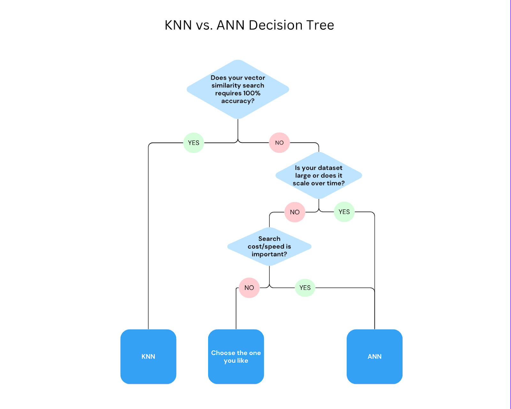

# How to Choose a Nearest-Neighbor Index Guide

## Introduction

When leveraging vector search in your application, selecting the right algorithm and accurately measuring recall are pivotal for enhancing search efficiency and result relevancy. This guide is crafted to assist developers in navigating through these crucial processes with ease, specifically for those who are developing with LangChain Python. To find out what is a good index for your vector database, the first decision you need to make is to choose from KNN or ANN.

## KNN vs. ANN

K-Nearest Neighbors (KNN) and Approximate Nearest Neighbors (ANN) are both nearest neighbor algorithms used for vector similarity search. KNN is a brute force algorithm that guarantees perfect recall at the cost of speed. ANN algorithms offer significantly faster speeds, but with less perfect recall.

For example, you have an item description and you want to search for the top 3 most similar items in the database. KNN checks every single item in the database and finds the top 3. On the other hand, ANN uses an algorithm to guess where the top 3 items are, and search only those vectors within the calculated scope, sacrificing some accuracy for speed. While KNN guarantees you get the most similar items, the computational cost is too high for scalability. ANN, although faster and good for a quick search, might occasionally miss an item that would have been selected.

## Choosing between KNN and ANN

In the context of vector search indexing, choosing between KNN and ANN is a trade-off between precision and efficiency. For applications with a small dataset (less than 10k) or requiring absolute precision, such as in legal or academic research where every possible relevant result must be identified, KNN is preferable despite its higher computational demands. In contrast, in scenarios where speed is crucial, resources are limited, and a high accuracy is still required–which is the case for most commercial usage–ANN is the better choice.

If you decide to adopt ANN indexing for your application’s vector similarity search, an important question arises: which algorithm to choose for ANN’s similarity approximation?

## Choosing the Right ANN Algorithm

When selecting an indexing algorithm for your application’s ANN vector search, it's essential to consider your specific needs and the characteristics of your dataset. There are two major categories of ANN algorithms:

- Graph-based algorithms are good at handling complex, high-dimensional data, offering faster search speeds by navigating through a network of interconnected data points. They are especially useful when the dataset is relatively larger, as they can efficiently traverse this network to find close matches. However, the memory usage and index building time could also grow significantly as the dataset grows compared to tree-based indexes. Example:
HNSW (through the pgvector extension)

- Tree-based algorithms organize data in a structured, hierarchical manner, making them efficient for lower-dimensional datasets. They offer a structured and often more resource-efficient approach to partitioning space and finding neighbors, but their performance degrades when the embeddings have high dimensionality but low information density. Examples:
IVF (through the pgvector++ extension)
IVFFlat (through the pgvector extension)
ScaNN (through the postgres_ann extension)

Here is a comparison table between Graph-based and Tree-based Indexing algorithms:

| Feature | Graph-based algorithm | Tree-based algorithm |
|---------|-----------------------|----------------------|
|Latency |Generally offers higher search efficiency, especially in high-dimensional spaces due to its ability to skip over irrelevant regions of the graph. Write latency is generally higher.| Efficiency depends on dataset distribution characteristics.|
| Accuracy | Can achieve high levels of accuracy by adjusting the graph's complexity (e.g., the number of edges per node), allowing for fine-tuning based on the dataset.| Accuracy is influenced by the tree's depth and branching factor. While very accurate in lower dimensions, accuracy decreases on embeddings with high dimensionality but low information density.|
| Examples | HNSW (through pgvector) | IVF (through pgvector++), IVFFlat (through pgvector),  and ScaNN (through alloydb_ann)|
| Index Creation Time| Slower | Faster|
| Memory used | More | Less |

## Next Step

By carefully evaluating your requirements for accuracy, computational resources, and scalability, you can select the optimal indexing approach for your vector search application. Once you've made the choice for your indexing algorithm, turn to [this guide](https://github.com/googleapis/langchain-google-alloydb-pg-python/tree/main/samples/index_tuning_sample/README.md) as your next step for evaluating indexing performance and fine-tuning your indexes as needed.
